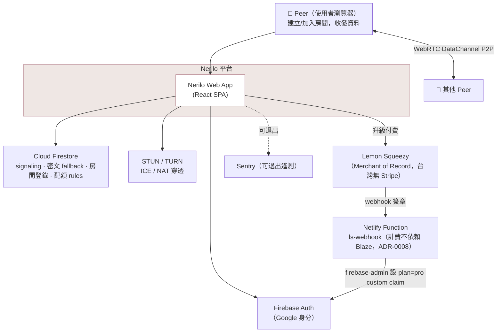
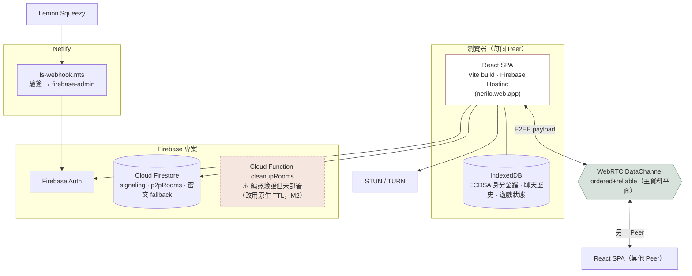
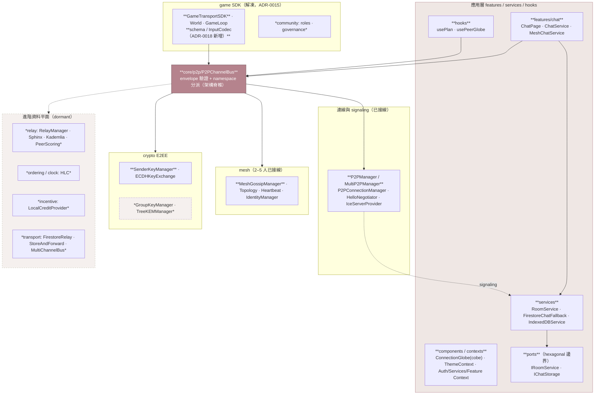
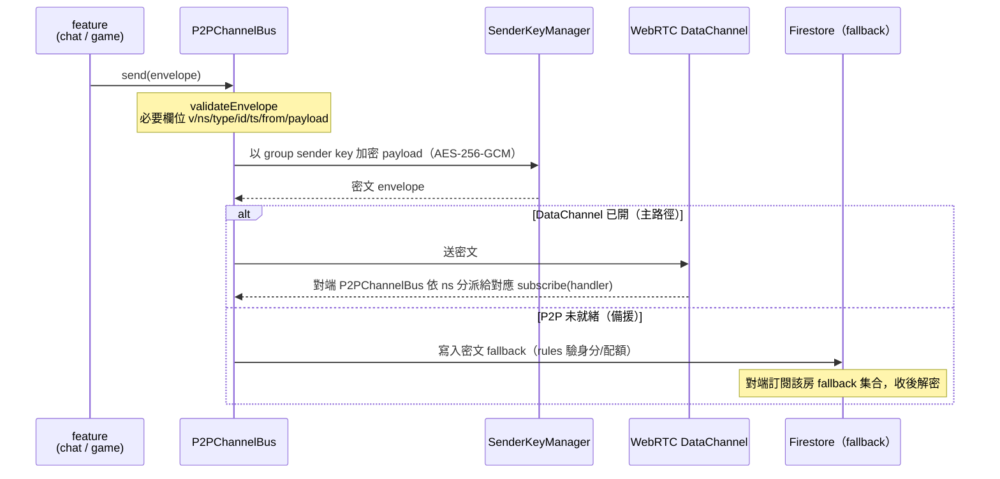

# Nerilo 架構 — C4 模型

> 現況快照（2026-07-04）。四層 C4：Context → Container → Component → Code。
> 誠實標註 dormant（已測未接線）與 not-deployed（存在但未上 production）的部分，
> 對齊 ADR-0007（模組分類）、ADR-0009（資料傳遞架構）、ADR-0015（遊戲為第二應用）。

Nerilo 一句話定位：**傳輸中立的 P2P 即時資料平台**；聊天與遊戲是騎在同一條
DataChannel 上、以 namespace 區分的「參考應用」，房間是「資料流容器」不是聊天室。

---

## C1 — System Context

誰用它、它依賴哪些外部系統。

**要點**
- 資料平面（peer↔peer 的實際內容）走 **WebRTC DataChannel**，不經任何伺服器。
- Firestore 只做**控制平面**：signaling（SDP/ICE 交換）、房間登錄與配額、P2P 失敗時的**密文** fallback relay。
- 金流刻意繞開 Firebase Blaze：LS webhook 由 **Netlify Function** 承載，經 firebase-admin 寫 custom claim。

---

## C2 — Container

可獨立部署/執行的單位與其資料存放。

**要點**
- SPA 部署於 **Firebase Hosting**；master push 自動 build+deploy（含 Firestore rules/indexes）。
- **Cloud Functions 從未上 production**：`cleanupRooms` 僅在 CI 編譯驗證；房間回收改用 Firestore 原生 TTL policy（M2）。
- CSP / 安全標頭在 `firebase.json` 收斂（`connect-src` 白名單含 googleapis/firebaseio/sentry）。

---

## C3 — Component（React SPA 內部）

`src/` 內部依「平面」分組。粗體=已接線，斜體=dormant（已測未接線，ADR-0007 第 1 類戰略資產）。

**要點**
- **P2PChannelBus 是脊椎**：所有 feature 用 `subscribe(ns, handler)` / `send(envelope)`；
  以 `envelope.ns` 分派（`chat` / `game` / `presence` …），核心協議零耦合到任何應用。
- 目前**實際接線**：2 人星型（P2PManager）、3–5 人 mesh gossip、E2EE（SenderKeyManager）、
  chat、payment/plan、地球 presence、game SDK（demo 排 M4）。
- **dormant 戰略資產**（已測未接線）：relay 洋蔥路由 + Kademlia DHT、HLC 排序、
  信用經濟、store-and-forward、TreeKEM 群組金鑰、community 治理。

---

## C4 — Code：出站訊息路徑（脊椎 P2PChannelBus）

放大「一則 payload 如何從應用送到對端」，展示 envelope 契約與 fallback。

**envelope 契約（型別 `P2PEnvelope`）**

| 欄位 | 意義 |
|---|---|
| `v` | 協議版本（跨版相容） |
| `ns` | namespace，決定分派對象（chat / game / presence） |
| `type` | 應用內訊息型別 |
| `id` / `ts` / `from` | 去重 / 排序 / 來源 |
| `payload` | 應用資料（E2EE 後為密文；game 熱路徑可走 ADR-0018 binary codec） |

**設計不變式**
- 核心 bus **不認識** namespace 清單——新應用只要自帶 `ns` 就能掛上（開閉原則）。
- Firestore 只見**密文**（ADR：fallback 也密文，含 `createdAt` 供 rules）。
- game INPUT 熱路徑可用 ADR-0018 的 `defineInput` 把 payload 從 ~60B JSON 壓到 ≤8B binary。

---

## 附：層級對照（快速索引）

| C4 層 | 對應 code |
|---|---|
| Container：SPA | `src/main.tsx` · `src/App.tsx` · Firebase Hosting |
| Container：webhook | `netlify/functions/ls-webhook.mts` |
| Component：脊椎 | `src/core/p2p/P2PChannelBus.ts` |
| Component：連線 | `src/core/p2p/*` |
| Component：E2EE | `src/core/crypto/SenderKeyManager.ts` |
| Component：房間 | `src/services/RoomService.ts` · `firestore.rules` |
| Component：game | `src/core/game/sdk/*`（含 `schema.ts` · `InputCodec.ts`） |
| Code：契約 | `src/types`（`P2PEnvelope`） |
