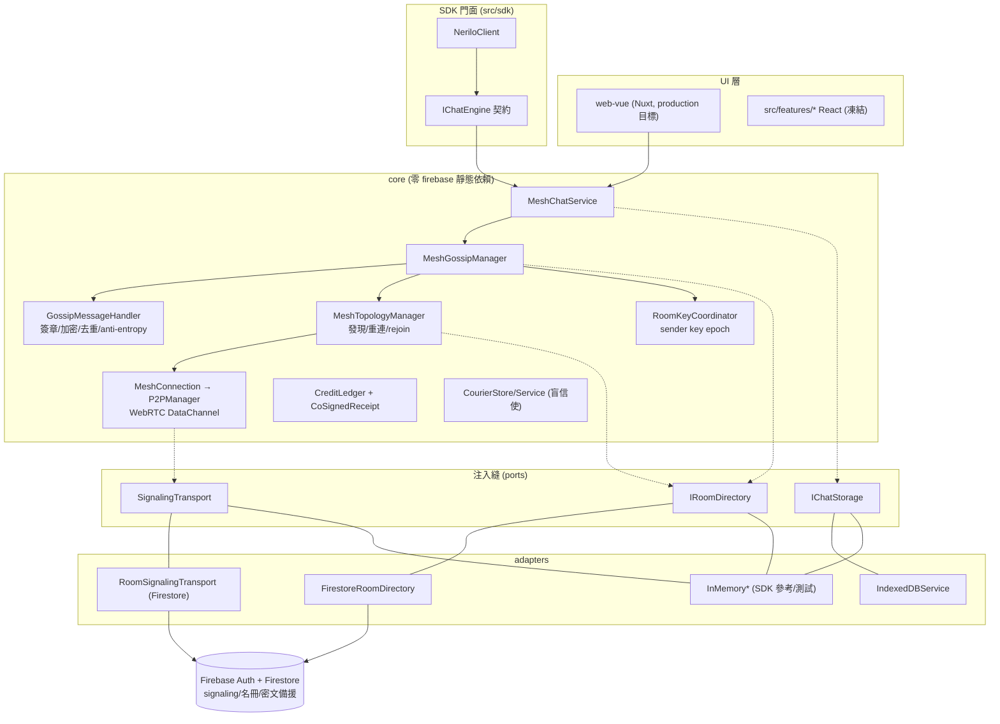
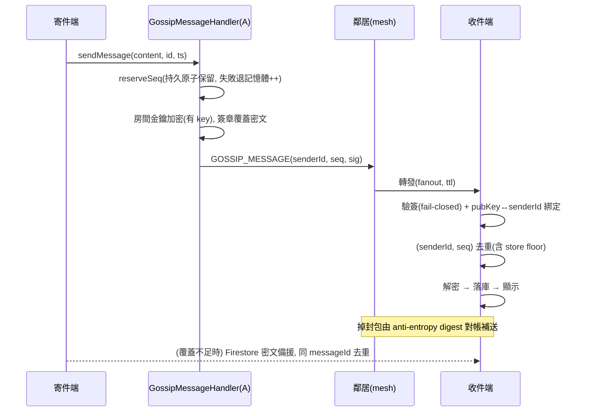
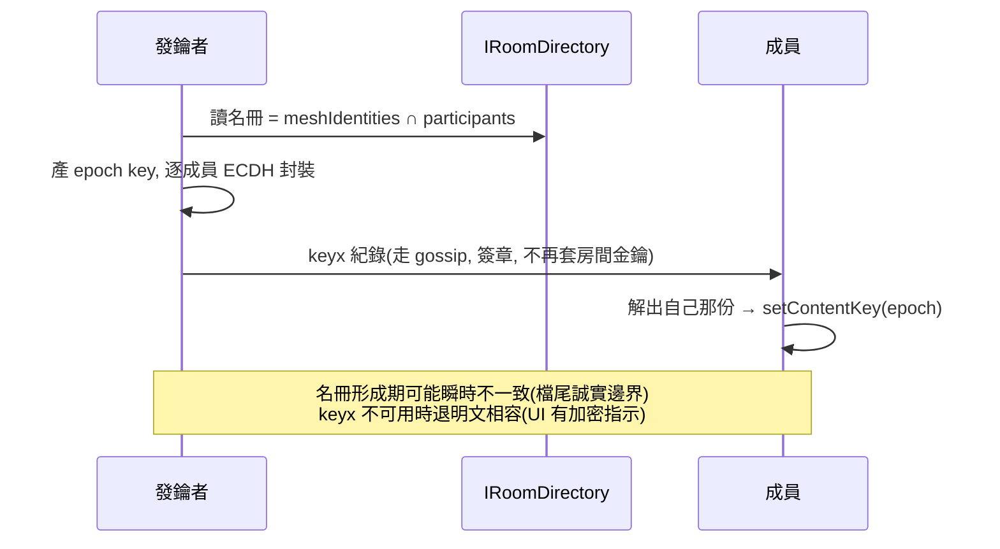
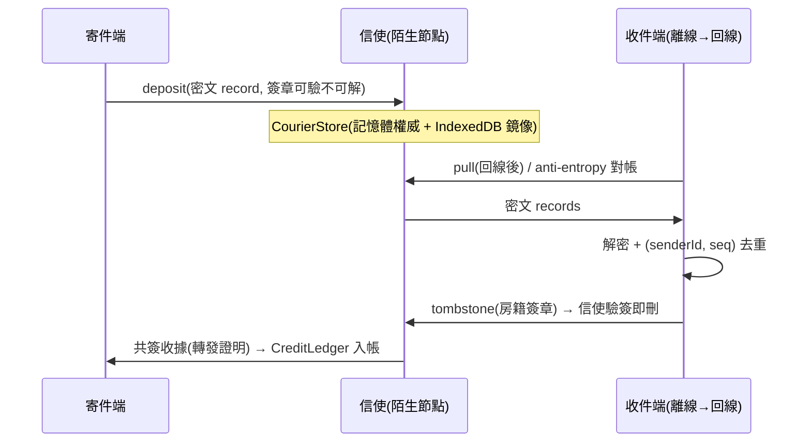
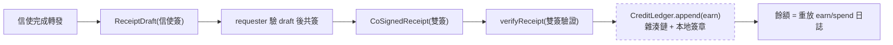
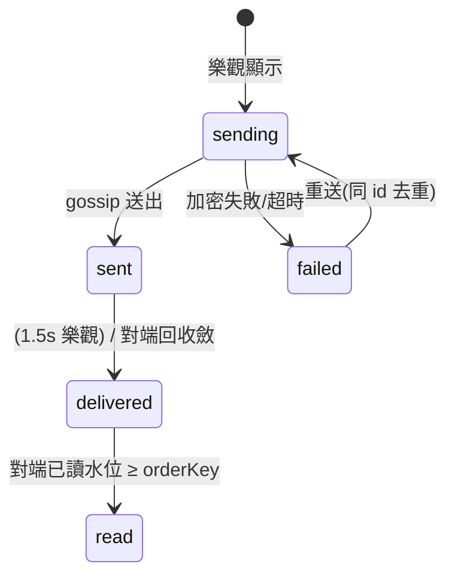
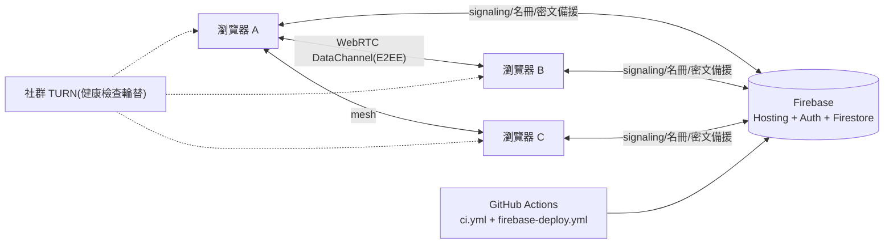

# Nerilo 核心不變量稽核：架構圖集

依實際程式碼產生（2026-07-13，branch feature/p2c-keyx-live-mesh @ 957bb2c）。不含虛構服務。

## 1. 系統總體架構

## 2. 訊息送收時序（恰好一次的機制）

## 3. 金鑰分發（keyx）

## 4. 盲信使寄存與墓碑

## 5. 點數：收據到入帳

註：Ledger 本身不強制「earn 必附收據」，正當性由呼叫端承擔（見風險 R5）。

## 6. 訊息狀態

## 7. 部署拓撲

