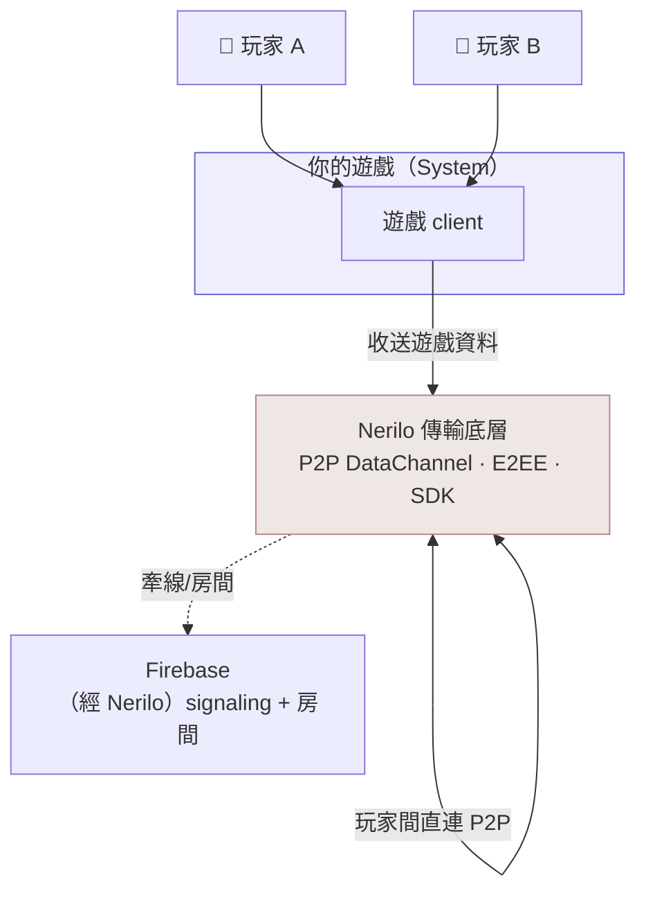
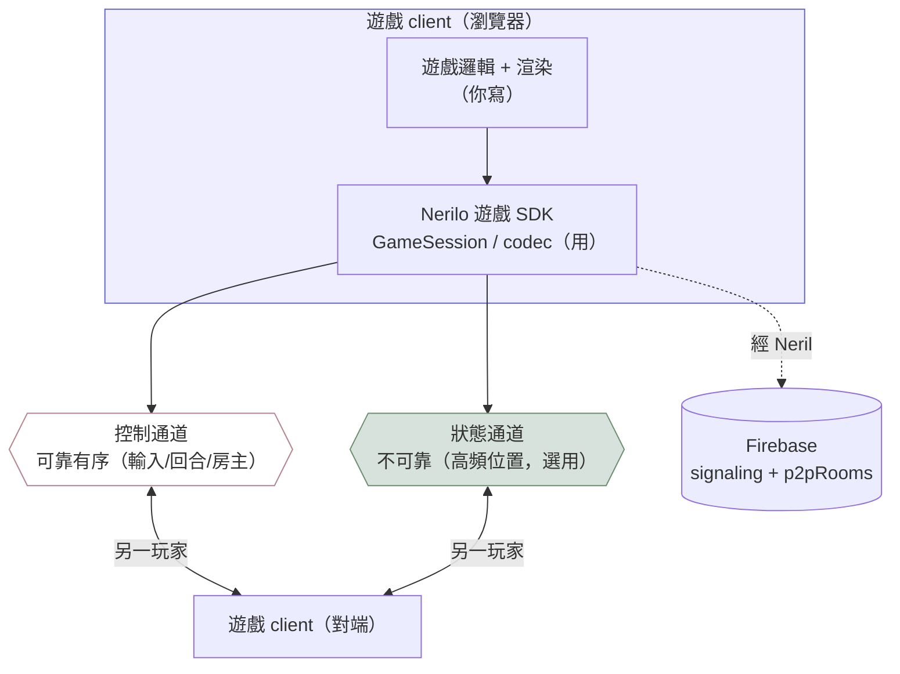
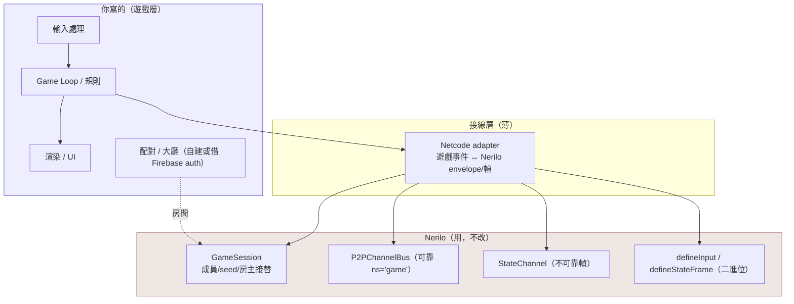
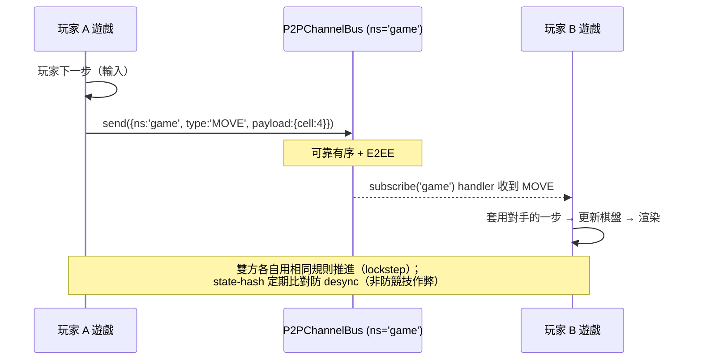

# 遊戲 on Nerilo — C4 架構

> 主體是「你的遊戲」，Nerilo 是它依賴的傳輸底層（外部容器）。四層由遠而近。
> 前提：小型合作/回合制遊戲（見 ADR-G01）。以「2 人回合制」為具體範例。

---

## C1 — System Context

**要點**：玩家的遊戲資料經 Nerilo 在兩端直連流動，不經你的伺服器。
Firebase 只做牽線與房間（Nerilo 已包好，你不直接碰）。

---

## C2 — Container

**要點**：
- 你寫「遊戲邏輯 + 渲染」；Nerilo SDK 給你 `GameSession` + 兩條通道 + codec。
- 回合制只需**控制通道**（可靠）。要 60Hz 位置同步才用**狀態通道**（不可靠）。

---

## C3 — Component（遊戲 client 內部）

**權責邊界（最重要）**：
- **你寫**：遊戲規則、輸入、渲染、配對/大廳、（若需要）反作弊。
- **Nerilo 給**：把 bytes 安全送到對端、成員/seed/房主接替、二進位編碼。
- 中間一層薄 **Netcode adapter**：把你的遊戲事件轉成 Nerilo 的 envelope/幀,反之亦然。

---

## C4 — Code：一回合的資料流（回合制範例）

**高頻動作遊戲的差異**：位置流改走 `StateChannel.send(Frame.encode(seq, rosterVer, {x,y}))`
（不可靠、丟幀天然覆蓋），收端 `FrameGate` 丟 stale 幀。控制訊息（房主/回合/名冊）
仍走可靠通道。

---

## 對照索引

| C4 層 | 對應 Nerilo API |
|---|---|
| 控制通道 | `P2PManager.getChannelBus()` → `subscribe('game')` / `send(envelope)` |
| 狀態通道 | `P2PManager.getStateChannel()` → `send(bytes)` / `onFrame` |
| 成員/seed/房主 | `GameSession`（`src/core/game/sdk/GameSession.ts`） |
| 二進位編碼 | `defineInput` / `defineStateFrame` / `defineComponent` |
| 版本協商 | HELLO `strictProtocols: { yourgame: N }` |
